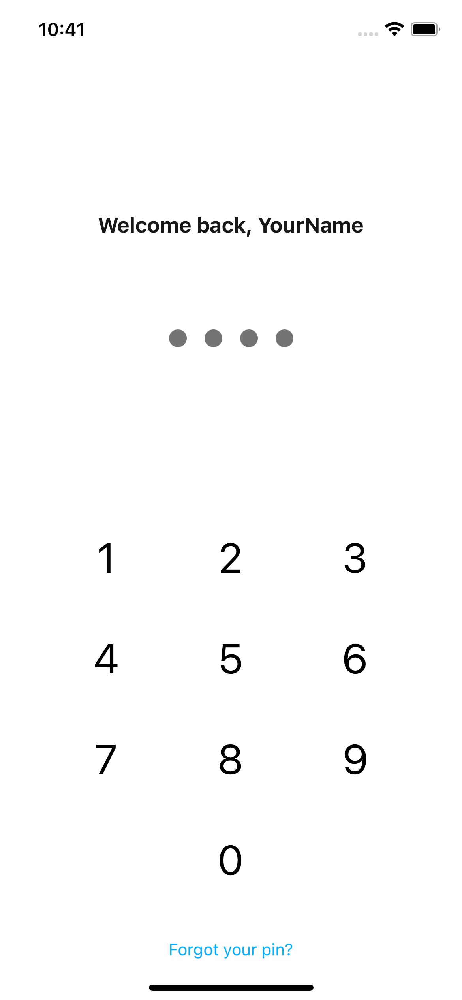

# react-native-simple-lock-screen

expo 44+
reanimated 



# Require
- expo 44.0.0 +
- react-native-reanimated 2.3.0 +

# Example
```tsx
<SafeAreaView style={{flex: 1}}>
    <LockScreen
        input={['1', '2', '3', '4', '5', '6', '7', '8', '9', '0']}
        validInput={['1', '1', '1', '1']}
        onValidInput={() => {
            alert('valid pin')
        }}
        errors={{
            3: {
                time: 120,
                errorMessage: 'Error, too manny attempts, try again in #_BLOCKED_TIME_COUNTDOWN_#',
            },
            6: {
                time: 360,
                errorMessage: 'Error, too manny attempts, try again in #_BLOCKED_TIME_COUNTDOWN_#',
            }
        }}
        buildInTopComponentOptions={{label: 'Welcome back, YourName'}}
        buildInBottomComponentOptions={{bottomComponent: {label: 'Forgot your pin?', onPress: () => {alert('forgot pin pressed')}}}}
    />
</SafeAreaView>
```
